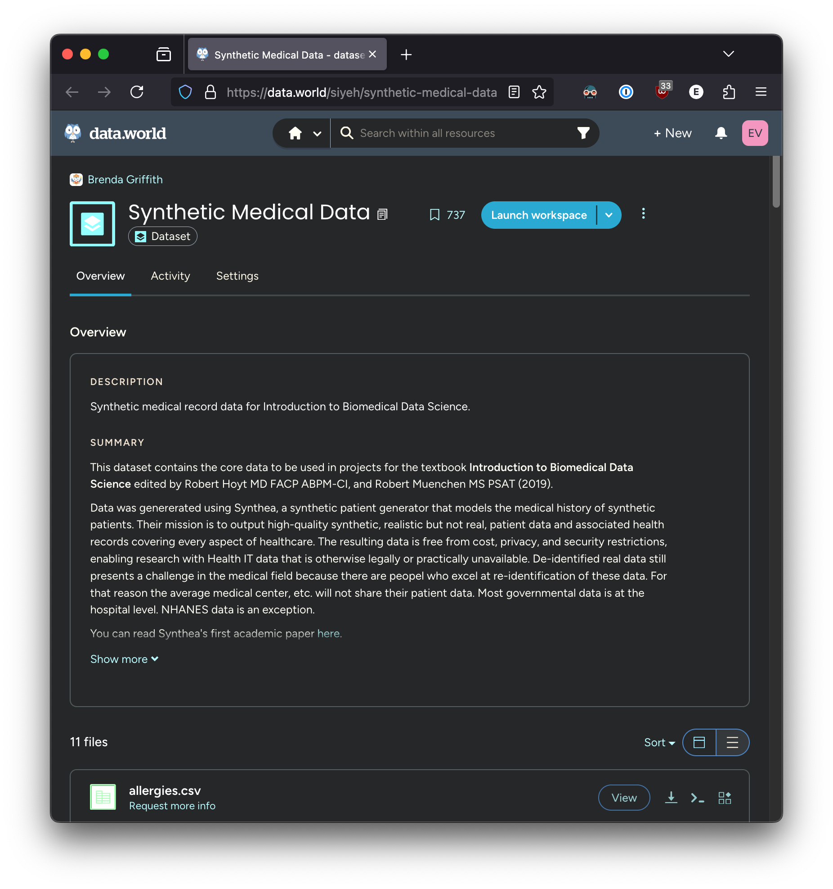
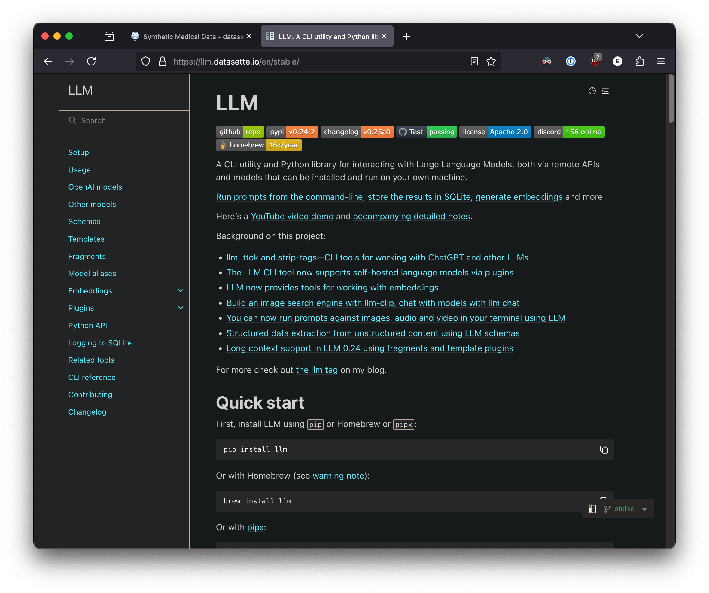
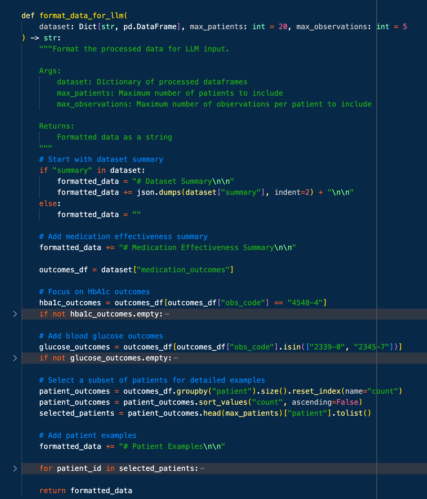

autoscale: true
theme: next, 1
code-language: Python

## AI In Healthcare, ML/DL Tutorial
### [Evan Jones](mailto:evan_jones@utexas.edu), UT ID:  `ej8387`
Assignment source at: 
[`https://github.com/etjones/aihc_hw7_llm_ej8387`](https://github.com/etjones/aihc_hw7_llm_ej8387)


---

# Diabetic Response to Medications

Can we get an LLM to identify which medications improve outcome for diabetic patients?

Here's the specific issue I used in generating further prompts and analysis:

**Identify correlations between specific medications and improved health outcomes for diabetic patients in the Siyeh Synthetic data set.**
    

---

# Dataset: Siyeh Synthetic Medical Data

I used Brenda Griffith's [Siyeh Synthetic Medical Data](https://data.world/siyeh/synthetic-medical-data) dataset. 



---

# Toolset

- Simon Willison's brilliant [`llm`](https://llm.datasette.io/en/stable/) Python package allows programmatic or command-line interactions with many LLMs
- [`pandas`](https://pandas.pydata.org/) for data loading and filtering
- Google's [Gemini 2.0 Flash](https://aistudio.google.com/prompts/new_chat?model=gemini-2.0-flash) LLM has a generous 1M token context window, great for data analysis
- Codeium's [Windsurf](https://windsurfai.org) AI-enabled IDE *radically* smooths friction for developing small-scale tools
- [Deckset](www.deckset.com) for Markdown -> Slide deck generation



---

# Data Filtering: 22Mb -> 776kb

- The Siyeh dataset is 22Mb, too large to fit in LLM context windows.

- **BUT**, we don't need all that data; just the parts that describe diabetic patients

- Using Windsurf, I wrote a data-filtering script, [`data_preparation.py`](data_preparation.py) to extract only Diabetes-relevant data from the original dataset.

- [`llm_data_loader.py`](llm_data_loader.py) digests that data and concatenates it into a single file  formatted for LLMs



---

# Tool Usage
- You know who does a better job writing specific, nuanced LLM prompts than people do? 
**LLMs**. 
All prompts generated by Claude 3.7 Sonnet. 

- [`llm`](https://llm.datasette.io/en/stable/) has a very handy [`--fragments`](https://llm.datasette.io/en/stable/fragments.html) flag that lets us send entire files to an LLM, while efficiently storing all queries and responses in a local database. It's magic!

```shell
llm -m gemini-2.0-flash -f data/llm_input_data.txt -f prompts/zero_shot_prompt.md > responses/zero_shot_response_1.md
llm -m gemini-2.0-flash -f data/llm_input_data.txt -f prompts/few_shot_prompt.md > responses/few_shot_response_1.md  
llm -m gemini-2.0-flash -f data/llm_input_data.txt -f prompts/chain_of_thought_prompt.md > responses/chain_of_thought_response_1.md
```

---

# Zero-shot prompt

```markdown
Analyze the provided Siyeh Synthetic medical dataset in llm_input_data.txt to identify correlations between specific 
medications and improved health outcomes for diabetic patients.

The dataset contains:
- A summary of the dataset with statistics on diabetic patients, conditions, medications, and observations
- Medication effectiveness summaries for HbA1c and blood glucose outcomes
- Detailed patient examples with demographics, medication histories, and health measurements

Focus on:
1. Analyzing the medication effectiveness summaries to identify which medications show the strongest
  correlations with improved outcomes
2. Examining the patient examples to understand individual responses to medications
3. Identifying patterns in health metric changes (HbA1c, blood glucose) following medication use
4. Determining which medications appear most effective across multiple patients
5. Considering potential confounding factors like patient demographics and comorbidities

Provide a detailed analysis of which medications appear most effective for diabetic patients in this dataset 
and explain your reasoning.
```

---

# Zero-shot results
(Complete response [here](responses/zero_shot_response_1.md) (100 lines))

**Summary:**
1. Insulin formulations and metformin demonstrate the strongest evidence for glycemic control. <br>
2. Semaglutide shows promising results but has limited sample size. <br>
3. Effectiveness varies by patient demographics and diabetes severity.


---

# Few-shot prompt

``` markdown
Task: Analyze correlations between medications and improved health outcomes for diabetic patients in the Siyeh Synthetic dataset provided in llm_input_data.txt.

Example 1:
Input: Patient with Type 2 Diabetes prescribed Metformin 500mg
- Before medication: HbA1c 8.2%, Fasting glucose 165 mg/dL
- After 6 months: HbA1c 7.1%, Fasting glucose 130 mg/dL
Analysis: This patient showed significant improvement in glycemic control after Metformin initiation, with HbA1c reduction of 1.1% and fasting glucose reduction of 35 mg/dL.

Example 2:
Input: Patient with Type 1 Diabetes prescribed Insulin Glargine
- Before medication: HbA1c 9.3%, Fasting glucose 210 mg/dL
- After 6 months: HbA1c 7.4%, Fasting glucose 140 mg/dL
Analysis: This patient demonstrated substantial improvement with Insulin Glargine, achieving a 1.9% reduction in HbA1c and 70 mg/dL reduction in fasting glucose.

Example 3:
Input: Patient with Type 2 Diabetes prescribed Sitagliptin
- Before medication: HbA1c 7.8%, Fasting glucose 145 mg/dL
- After 6 months: HbA1c 7.6%, Fasting glucose 140 mg/dL
Analysis: This patient showed minimal improvement with Sitagliptin, suggesting it may be less effective for this particular case.

Now, analyze the Siyeh Synthetic dataset in llm_input_data.txt to identify which medications correlate with the best outcomes for diabetic patients. The file contains:
- Medication effectiveness summaries showing mean changes in HbA1c and blood glucose
- Patient examples with detailed medication histories and health outcomes
- Timelines showing health metrics before and after medication administration

Consider factors like:
1. Changes in HbA1c and blood glucose levels as shown in the medication effectiveness summaries
2. Consistency of results across multiple patients
3. Magnitude of improvements in health metrics
4. Time between medication start and observed improvements
5. Patient demographics that might influence outcomes

Provide a comprehensive analysis of medication effectiveness for diabetic patients in this dataset.
```

---

# Few-shot results

See [`few_shot_response_1.md`](responses/few_shot_response_1.md) for complete response (62 lines) . 

**Summary:**
1. Insulin formulations most effectively reduce HbA1c, while metformin shows strong, consistent glycemic control. <br>
2. Combination therapies appear more effective than monotherapy for poorly controlled diabetes. <br>
3. Medication effectiveness varies based on patient characteristics and diabetes severity. <br>


---

# Chain of Thought prompt

```markdown
Analyze the Siyeh Synthetic medical dataset in llm_input_data.txt to identify correlations between specific medications and improved health outcomes for diabetic patients. Think through this problem step by step:

Step 1: First, review the dataset summary section.
- Note the total number of diabetic patients in the dataset
- Identify the key health metrics being tracked (HbA1c, blood glucose, etc.)
- Understand the scope of the medication data available

Step 2: Analyze the medication effectiveness summaries.
- Examine the HbA1c Outcomes by Medication table
- Note which medications show the largest mean reductions in HbA1c
- Consider the sample size (Count) for each medication to assess reliability
- Repeat this analysis for the Blood Glucose Outcomes by Medication table
- Identify medications that perform well across both metrics

Step 3: Examine the patient examples to understand individual responses.
- Look at the demographic information for each patient
- Review their medication histories and when each medication was started
- Analyze the health outcomes tables showing before/after values
- Study the timelines showing how metrics changed relative to medication start dates

Step 4: Look for patterns in medication effectiveness.
- Identify medications that consistently show improvements across multiple patients
- Note the magnitude of improvements for different medications
- Consider the timeframe needed to see improvements with different medications
- Look for any medications that show minimal or negative effects

Step 5: Consider potential confounding variables.
- Examine whether patient demographics correlate with medication effectiveness
- Look for patterns in comorbidities that might influence outcomes
- Consider whether medication combinations appear more effective than single medications
- Note any timeline patterns that might suggest external factors affecting outcomes

Step 6: Draw conclusions about medication effectiveness.
- Rank medications by their effectiveness in improving glycemic control
- Identify which medications show the most consistent positive outcomes
- Note any medications that appear ineffective in this dataset
- Consider which medications might be most appropriate for specific patient subgroups

Based on this step-by-step analysis, provide a detailed report on which medications correlate with the best outcomes for diabetic patients in the Siyeh Synthetic dataset, including supporting evidence from your analysis.
```
---

# Chain of Thought results
(Complete response [here](responses/chain_of_thought_response_1.md) (70 lines))

**Summary:**
1. Insulin formulations show best HbA1c reduction, while metformin offers consistent effectiveness with fewer side effects.<br>
2. Patient demographics and comorbidities significantly impact medication effectiveness.<br>
3. Limited sample sizes for most medications suggest caution in generalizing results.<br>
  


---

# Prompting Evaluation

Surprisingly, each prompt returned very similar results:
- Responses ranged from 62 to 100 lines, something like 2-4 pages.
- Each identified Insulin, Metformin, and Semaglutide as the most effective drugs for managing diabetic blood chemical markers.
- Each had similar caveats about demographics, sample size, and synthetic data quality.
- Each dealt with the pre-digested data set clearly; there was no clear benefit to adding extra examples in the few-shot prompt, or to adding multi-step instructions.


As of Spring 2025, LLMs have been progressing more by using internal Chain of Thought processes. It's not clear that explicitly providing your own chain of thought prompt will necessarily improve a model response unless you really do want to take different analysis steps than a common-sense approach. 

---

# Possible Improvements
- Each LLM response highlighted similar data quality issues of demographic representation, sample size, etc. 
- These are the same issues any scientist faces when trying to make an argument with data; they're not unique to LLMs.
- To truly evaluate LLM data analysis performance, I would want to have a known "correct" interpretation which the LLM might or might not identify. As it is, each prompt identified the most popular and effective medications against diabetes. It's difficult to tell if this is insightful or simply obvious from the dataset.
- A better test might be to identify previously unknown patterns in medication data. Examples:
  -  GLP-1 inhibitors were caused weight loss in diabetic patients. It took 15+ years for off-label uses to be noticed and applied.
  -  Viagra was originally developed as a hypertension medication; its anti-ED effects were only noticed after the fact. Would an LLM have noticed this effect on its own?
